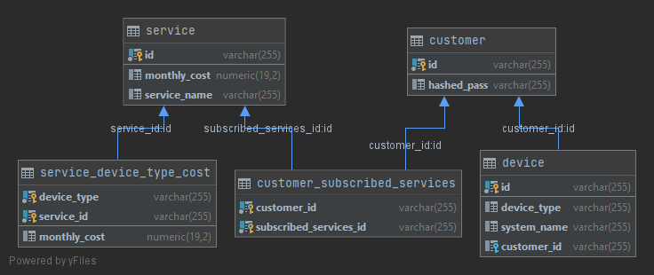

# rmm-services-server-app

REST API for RMM service management and billing

## To run the application:

1. Modify the url, username, and password in application.yml to point to a postgresql database with no tables. The
   necessary tables will be created at application startup, and initial configuration data loaded.

```
spring:
  datasource:
    url: jdbc:postgresql:jonegan
    username: appowner
    password: ownerpass
```

2. Build with maven

```
mvn clean package
```

3. java -jar target/rmm-services-server-app-0.0.1-SNAPSHOT.jar

## Tables

The application creates and uses 5 tables:

1. SERVICE - defines the services offered by the RMM company, and holds the monthly cost for the service, if the cost
   does not vary by device type
2. SERVICE_DEVICE_TYPE_COST - holds the monthly cost for services when the cost varies by the type of the device
3. CUSTOMER - this also acts as the user table, holds the hashed password
4. DEVICE - stores the devices configured by each company
5. CUSTOMER_SUBSCRIBED_SERVICES - stores the services subscribed to by each company



# Includes the following APIs:

See file rest-api.http for samples of each type of request.

## Unsecured services

* `GET /services`
  Returns info about all services available from the RMM service provider.
* `POST /signup`
  Creates a new customer in the system, which enables access to the secured services with that user and pass to perform
  customer actions. The customer will initially have 0 devices, and subscribe to 0 services.

## Secured services

These require Basic Auth with a username/pass from the /signup service. The customer id in the URL must match the
authenticated user. The data is limited to only this customer's data.

### Devices

* `GET /customers/{customerId}/devices`
  Get all devices for a customer
* `GET /customers/{customerId}/devices/{deviceId}`
  Get details of a single device
* `POST /customers/{customerId}/devices`
  Create a new device associated with the customer
* `PUT /customers/{customerId}/devices/{deviceId}`
  Modify a device
* `DELETE /customers/{customerId}/devices/{deviceId}`

### RMM Services

* `GET /customers/{customerId}/services`
  Get all services a customer is enrolled for
* `POST /customers/{customerId}/services/{serviceId}`
  Add the specified service to the customer
* `DELETE /customers/{customerId}/services/{serviceId}`
  Remove the specified service from the customer

### Billing

Two forms of retrieving the bill for the customer, one implemented in JPA and the other in JDBC

* `GET /customers/{customerId}`
  JPA version
* `GET /customers/{customerId}/bill`
  JDBC version
